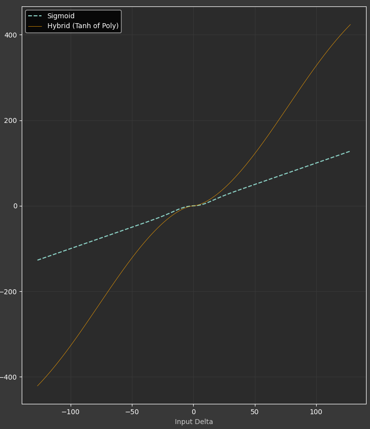

> [!CAUTION]
> Work in progress, acceleration does not work as intended!

The main goal is to simulate feel of apple's magic trackpad feel.
### Configuration

```
glidepoint: glidepoint@2a {
    compatible = "cirque,pinnacle";
    ...

    // Enable and configure pointer acceleration
    hybrid-acceleration;
    acceleration-threshold=<150>;
    acceleration-factor=<275>;
};
```
The factor and threshold are divided by 100 (`POINTER_ACCELERATION_SCALE`) to convert them into appropriate float values, as Zephyr only supports integers for property types.

### TODO
- [ ] Replace `tanhf` w/ lookup table
- [ ] Benchmark 'input lag' with each acceleration functions
- [ ] Config for explicit X/Y acceleration curves (X axis should be more responsive) - could be accomplished w/ `&zip_x_scaler` 
- [ ] Enum for configuring acceleration strategy
- [ ] Add pointer smoothing (data report interval???)
- [ ] 

### Strategies comparison
> [!NOTE]
> Personally I like the feel of high threshold/factor variant.

