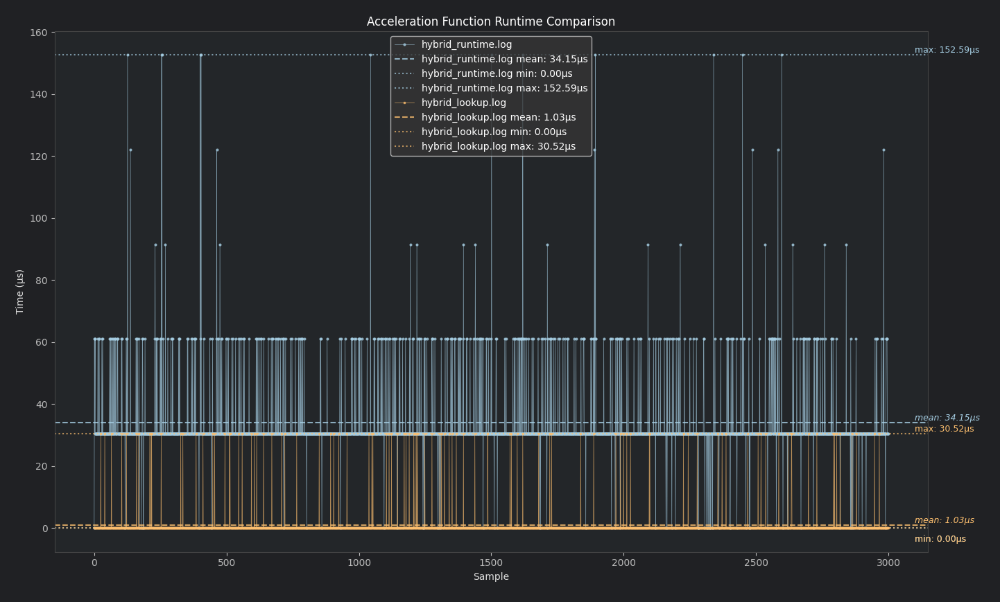

## BENCHMARKS

> [!NOTE]
> Done for fun & curiosity

Runtime 'curve calculation' on every pointer move is a waste of resources so lookup table should be better, right? Yes, much better! Why:

- No `pow/tanh` in runtime
- Always clamped to int8_t (runtime was also clamped)
- Memory-light ~256 bytes
- Init time: ~3 ms

## RESULTS
### Hybrid acceleration curve
> 97% cut in execution time, no surprises here
 
In 'high-frequency' event loops (like pointer updates), this is a huge improvement, kind of...

Assuming the system clock (`CONFIG_SYS_CLOCK_HW_CYCLES_PER_SEC`) is 32768 Hz (which is a common RTC value - in my case NRF52840 it is):

Each tick: 1 / 32768 = 30517 nanoseconds
 - 1 tick - 30517 ns
 - 2 ticks - 61035 ns
 - 3 ticks - 91552 ns

So in this use case 30517 ns is the best resolution available. I can assume the code is always executing in 1 or 2 clock cycles (for lookup table). Anyway there's visible improvement which should correspond to:
 - smoother performance 
 - lower latency
 - reduced power consumption (I'll probably benchmark power draw later)
 - minimizing input lag

Using the lookup version gives ~33x (1 tick) performance improvement.
That’s an excellent tradeoff for just 256 bytes of memory.

### Results base on 3000 samples


## Methodology
Log time in a specific format for python script `log_accel_runtime` (logs time delta in nanoseconds)
### Lookup:
```clang
#include <zephyr/sys_clock.h>

...

void log_accel_runtime(uint32_t cycles) {
    printk("ACCEL_CYCLES,%u\n", cycles);
}

...

if (config->hybrid_acceleration) {
    uint32_t start = k_cycle_get_32();
    
    dx = data->accel_lookup[dx + 127];
    dy = data->accel_lookup[dy + 127];

    uint32_t end = k_cycle_get_32();
    uint32_t elapsed_ns = (uint32_t)(((uint64_t)(end - start) * 1000000000ULL) / CONFIG_SYS_CLOCK_HW_CYCLES_PER_SEC);
    log_accel_runtime(elapsed_ns);
}
```
### Runtime:
```clang
if (config->hybrid_acceleration) {
    uint32_t start = k_cycle_get_32();
    
    // Calculate value every time...
    dx = apply_hybrid_acceleration(dev, dx);
    dy = apply_hybrid_acceleration(dev, dy);

    uint32_t end = k_cycle_get_32();
    uint32_t elapsed_ns = (uint32_t)(((uint64_t)(end - start) * 1000000000ULL) / CONFIG_SYS_CLOCK_HW_CYCLES_PER_SEC);
    log_accel_runtime(elapsed_ns);
}
```
Enable logs and save for both runtime/lookup (don't forget to move the pointer)
```bash
tio -L --log-file hybrid_lookup.log /dev/tty.usbmodemXXXXX
tio -L --log-file hybrid_runtime.log /dev/tty.usbmodemXXXXX
```
Run the python script:
```bash
python compare_runtime.py hybrid_runtime.log hybrid_lookup.log --max-samples=3000
```
